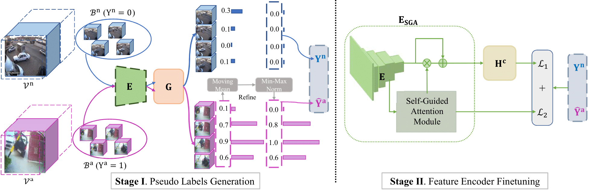

# MIST_VAD
	
[](https://paperswithcode.com/sota/anomaly-detection-in-surveillance-videos-on?p=mist-multiple-instance-self-training)
[](https://paperswithcode.com/sota/anomaly-detection-in-surveillance-videos-on-1?p=mist-multiple-instance-self-training)

Official codes for CVPR2021 paper "MIST: Multiple Instance Self-Training Framework for Video Anomaly Detection"

[***```Project Page```***](https://kiwi-fung.win/2021/04/28/MIST/)

[***```Paper```***](https://arxiv.org/abs/2104.01633)




## Updates
**`[May 28th]`** Testing / Training codes have been released. The codes are cleaned out from the original ones without full verification. 
There maybe any unexpected bugs. I will improve it later if I have time.
## Requirements
- python>=3.6
- apex
- pytorch=1.5.0+cu101
- torchvision=0.6.0+cu101
- tensorboardX
- h5py
- opencv
- scikit-learn
- yacs

## Testing

Pretrained models have been uploaded on [OneDrive](https://1drv.ms/f/s!Ai48CHyipiNUkFTHTQGze7QLY1Fn).

The h5py file for ShanghaiTech and its corresponing annotations are uploaded on `[BaiduYun]` with multiple sub-files, you can open/unzip it with `WinRAR`
BaiduYun link：https://pan.baidu.com/s/1sQUGXj-BnLDGczWuGkBWdA, code：kym5

To test the pretrained checkpoints, you are recommended to read [Testing_Guidelines.md](https://github.com/fjchange/MIST_VAD/blob/master/Testing_Guidelines.md) for more details.

## Training
We have released the training codes for ShanghaiTech on both stage 1 and stage 2. For convenience to repeat our experiments, we presents the pseudo labels files in `data/` dir. 
The details of training are listed in [Training_Guidelines.md](https://github.com/fjchange/MIST_VAD/blob/master/Training_Guidelines.md).

## Reference
If you feel the codes help, please cite our paper.

Recommended Citation Form:
> Jia-Chang Feng, Fa-Ting Hong and Wei-Shi Zheng. “MIST: Multiple Instance Self-Training Framework for Video Anomaly Detection, Proceedings of the IEEE International Conference on Computer Vision and Pattern Recognition. 2021.
